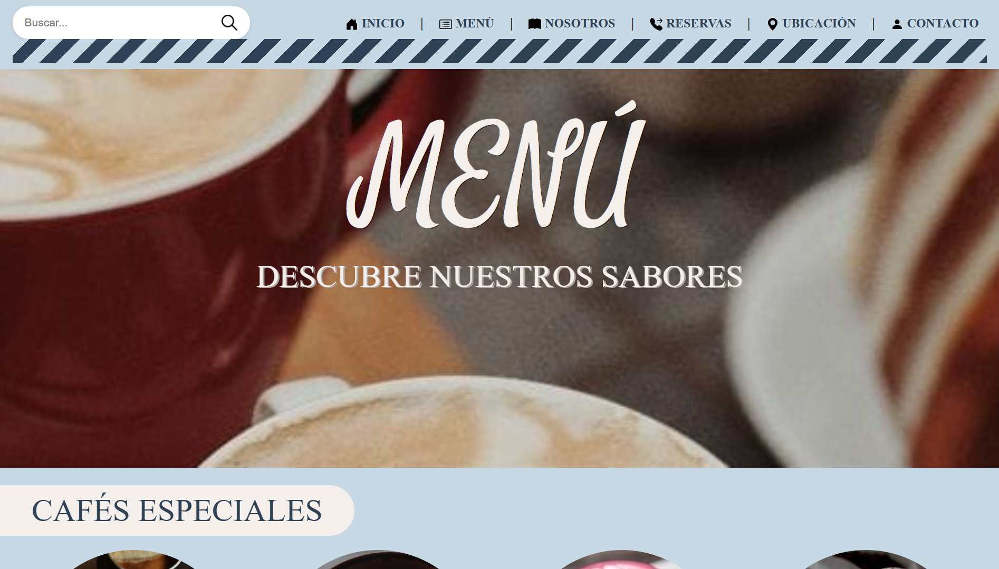
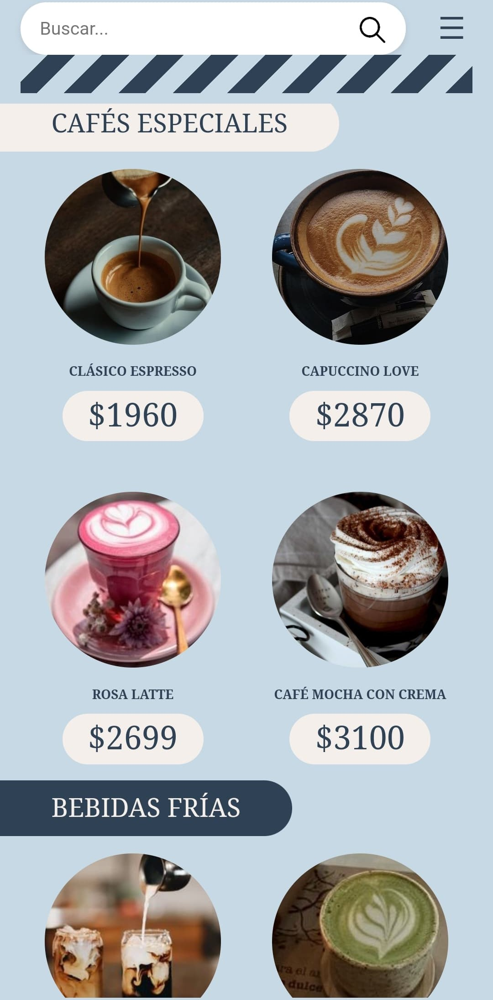

# Couleurs, Cafetería - 2025 

# Cafetería Ficticia

Este proyecto es una representación de una cafetería ficticia, alojada en Caleta Olivia, Santa Cruz. Está desarrollada con el objetivo de demostrar habilidades en diseño web responsivo y funcionalidad dinámica. La aplicación cuenta con varias vistas y está diseñada para ofrecer una experiencia de usuario agradable tanto en dispositivos móviles como en pantallas superiores.

## Características principales

- **Diseño responsivo:**
  - Totalmente adaptado para dispositivos móviles y escritorios.
  - La versión para ipads y tablets puede presentar pequeños fallos, pero sigue siendo funcional y utilizable.

- **Tecnologías utilizadas:**
  - **HTML**: Estructura del proyecto.
  - **CSS**: Diseño y estilos, incluyendo responsividad.
  - **JavaScript**: Lógica y dinamismo en la interacción del usuario.
  - **Firebase**: Base de datos para almacenamiento y manejo de información.

- **Interactividad:**
  - Cada botón y opción es completamente funcional.
  - Formularios rellenables y accesibles.

- **Diseño visual:**
  - Colores relajantes y armoniosos, ideales para transmitir una sensación cálida y acogedora.
  - Diseño ideal para usarse como plantilla en proyectos similares.

- **Menú dinámico:**
  - Presenta una oferta dinámica de productos y precios, adaptada para el cliente.

## Estructura del proyecto

El proyecto consta de seis vistas principales, cada una diseñada para representar diferentes secciones de una cafetería. Estas vistas incluyen:

1. **INICIO:** Presentación general de la cafetería.
2. **MENÚ:** Sección dinámica con la oferta de productos y precios.
3. **NOSOTROS:** Información adicional sobre la cafetería.
4. **RESERVAS:** Formulario accesible para reservar una cita en la cafetería.
5. **UBICACIÓN:** Se da mayor conocimiento sobre la ubicación y horarios de atención de la cafetería.
6. **CONTACTO:** Formulario accesible para comunicarse con la cafetería directamente. Disponibles las redes de la cafetería para seguirla y/o conocerla.

## Vista previa 

A continuación, se presentan algunas capturas de pantalla del proyecto:

### Escritorios:

  
  

  
  

  
  

### Móviles:

  
  
  

## Enlace al proyecto: 

Puedes visitar la versión en vivo del proyecto en el siguiente enlace: 

## Autores

Encargado del desarrollo: **Darián Grabano**.
 
Ide/s utilizado/s: Visual Studio Code.
 
Redes sociales:
- Instagram: https://www.instagram.com/nahuelgra22
- Correo: dariangrabano22@gmail.com
- Facebook: https://www.facebook.com/darian.grabano

Encargada del diseño: **Thiara Parugues**.
 
Herramienta/s de diseño: Canva.
 
Redes sociales:
- Instagram: https://www.instagram.com/cutthiee
- Correo:
- Facebook: https://www.facebook.com/thiskyxx

Este proyecto fue desarrollado con dedicación y atención al detalle. Si tienes alguna pregunta o sugerencia, no dudes en contactarnos. Escríbenos, indícanos que vienes por este proyecto y cuéntanos lo que necesites.

---

¡Gracias por visitar este proyecto! Espero que lo disfrutes tanto como nosotros disfrutamos creándolo.

